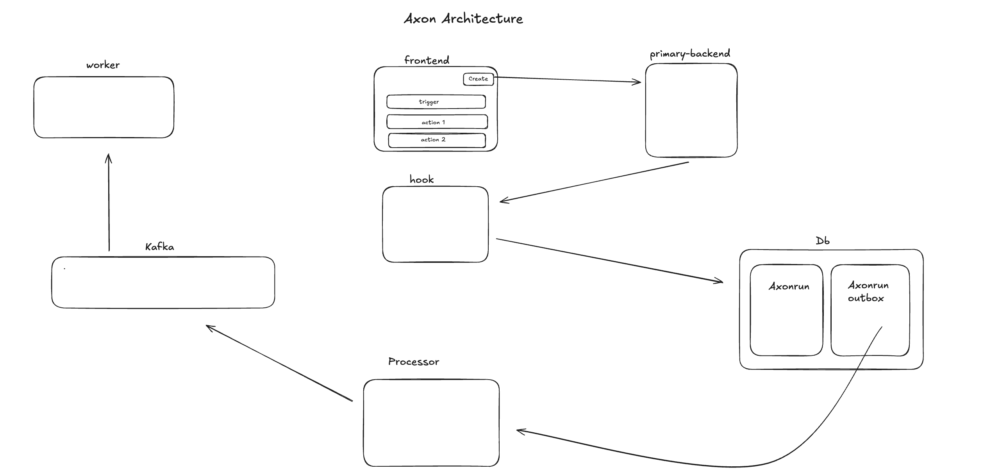

# Axon - Workflow Automation Platform

Axon is a powerful, event-driven workflow automation platform that allows users to define **triggers** and **actions** across multiple services. It is designed for scalability and reliability using Kafka, Solana, PostgreSQL, and clean microservice architecture.

---

## 🧠 Architecture Overview




### Components

- **Frontend**
  - User interface to create and manage workflows.
  - Lets users define triggers and multiple actions.
  - Sends workflow definitions to the backend.

- **Primary Backend**
 - Handles API requests from the frontend to create and manage workflows.
-  Generates unique webhook URLs for trigger-based workflows.

- **Hook Service**
  - Receives and persists workflow configurations.
  - Writes to `axonrun` and `axonrun_outbox` tables.
  - Triggers further processing.

- **Processor**
  - Monitors the database for outbox entries.
  - Publishes events to Kafka to signal workflow execution.

- **Kafka**
  - Decouples producers and consumers.
  - Handles message delivery and retries.
  - Ensures scalable and reliable workflow execution.

- **Worker**
  - Consumes Kafka events.
  - Executes side effects like sending emails or transferring SOL.

- **Database (PostgreSQL)**
  - Stores workflow definitions (`axonrun`) and outbox events (`axonrun_outbox`).
  - Ensures data consistency and auditability.

---

## 🚀 Features

- Event-driven architecture using Kafka.
- Outbox pattern for reliable message dispatch.
- External webhook and email support.
- SOL transfer functionality via Solana.
- Modular microservice design.

---

## 🛠 Tech Stack

| Layer         | Tech Used                          |
|--------------|-------------------------------------|
| Frontend     | React / Next.js                     |
| Backend      | Node.js / Express / TypeScript      |
| Messaging    | Kafka                               |
| DB           | PostgreSQL                          |
| Blockchain   | Solana (`@solana/web3.js`)          |
| Email        | Brevo SMTP (`nodemailer`)           |

---

##  Getting started locally

# Clone the repo
git clone https://github.com/daljeet2001/Axon.git

# Install dependencies
- cd primary-backend
- cd hook
- cd processor
- cd worker
- cd frontend

npm install

# Start Kafka and PostgreSQL (locally or via Docker)

# Run backend services
npm run dev


.env for worker and all others just have database_url in their .env


---

## 🔐 Environment Variables

```env
# Solana
SOL_PRIVATE_KEY=

# Brevo SMTP
BREVO_SERVER=smtp-relay.brevo.com
BREVO_LOGIN=contact@yourdomain.com
BREVO_API_KEY=xkeysib-...

# Database_url
DATABASE_URL=your_postgres_database_url

